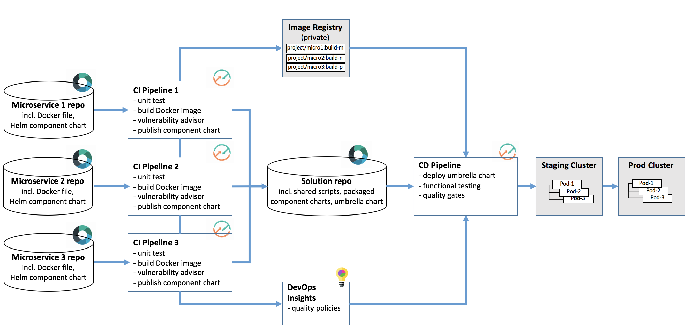

# Develop and test microservices with Kubernetes and Helm

### Continuously deliver a microservices app for Kubernetes using a Helm umbrella chart
Get started with this sample, which is an online store that consists of three microservices: a Catalog API, an Orders API, and a UI that calls both of the APIs. The sample includes a DevOps toolchain that is preconfigured for continuous delivery, hosted Git source control, functional testing, issue tracking, online editing, and messaging. 

### To get started, click this button:

 

---
### Learn more 

* [Step by step tutorial](https://www.ibm.com/devops/method/tutorials/tutorial_toolchain_microservices_cd)
* [Getting started](https://bluemix.net/devops)
* [Documentation](https://console.ng.bluemix.net/docs/services/ContinuousDelivery/index.html?pos=2)
* [Toolchains on the Bluemix Garage Method site](https://www.ibm.com/devops/method/category/tools)
* Blog: [Bluemix Continuous Delivery is now live](https://www.ibm.com/blogs/bluemix/2016/11/bluemix-continuous-delivery-is-now-live/)
* Video: [Introducing IBM Bluemix Continuous Delivery](https://www.youtube.com/watch?v=QPSAZ64APpc&feature=youtu.be) (2m12s)
