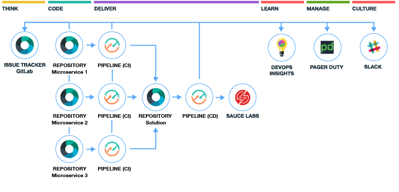
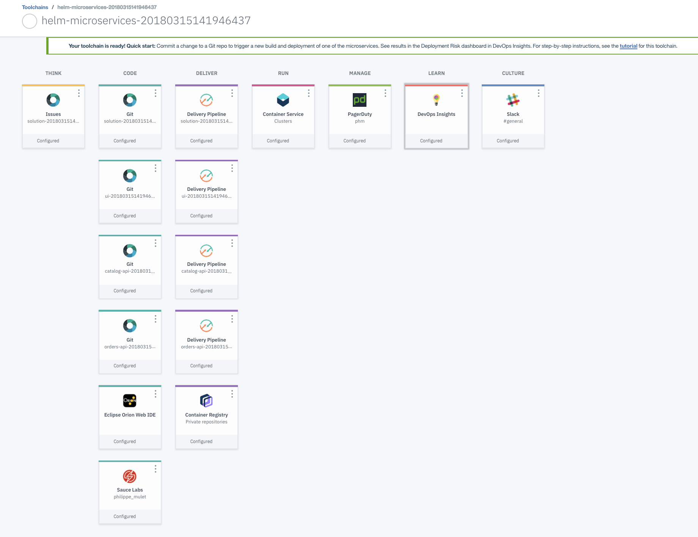
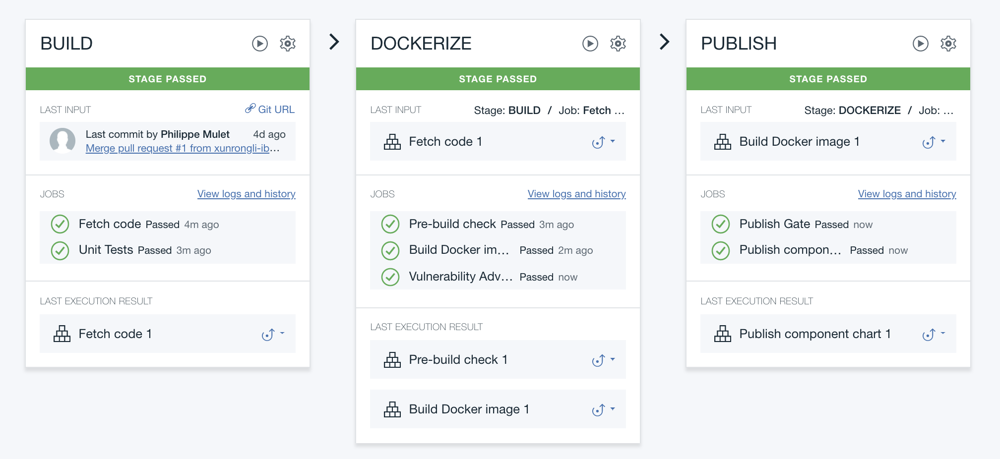
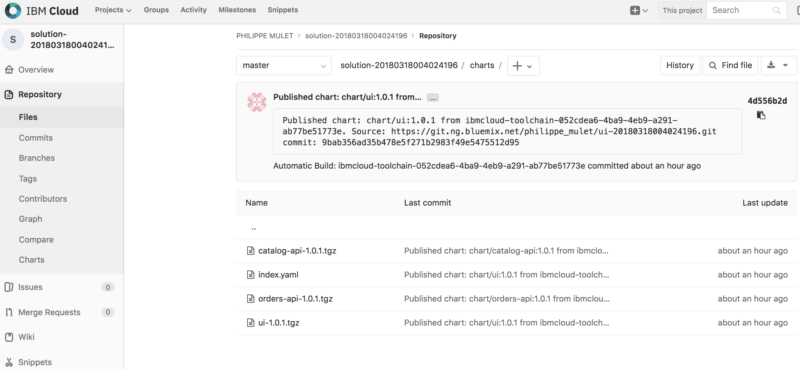
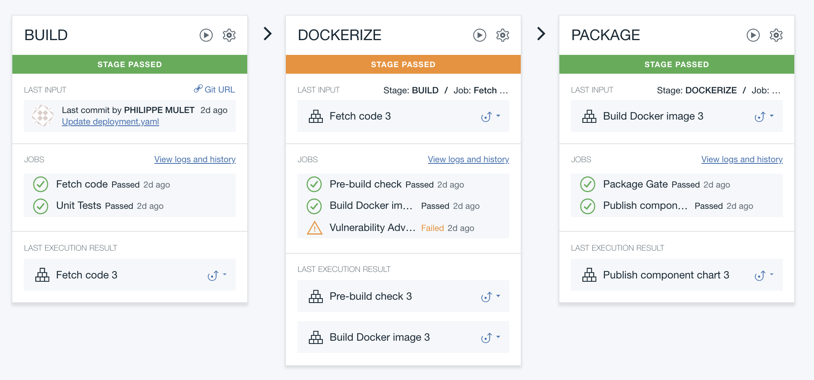
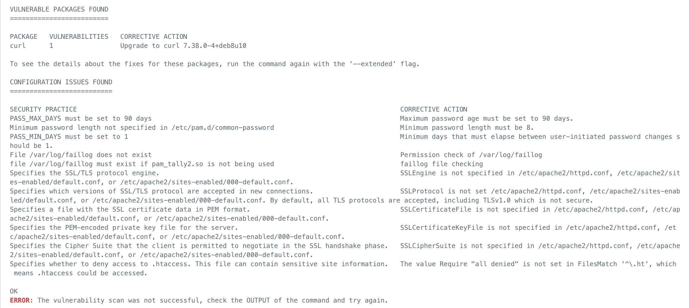

# Develop and test microservices with Kubernetes and Helm

## Prerequisites
  * Need an existing cluster and API key
  * See instructions at: https://www.ibm.com/cloud/garage/tutorials/devops-toolchain-integration?task=0
  * Note: toolchain can only be created in US-South region (DevOps Insights only there)
## Context
  * Team building an online store application, formed with 3 microservices kept in separate Git repos
  * Using Kubernetes with Continuous Delivery to build, test and deploy the application
  * Using Helm release management within Delivery Pipeline, separation of duties between squad developing and SRE deploying
  * Speed with control, using Insights quality gates and traceability across toolchains 
  * Selenium testing with SauceLabs, notifications through Slack and alerting through Pagerduty
  
## Setup the toolchain
  
  [](https://console.bluemix.net/devops/setup/deploy?repository=https://github.com/open-toolchain/microservices-helm-toolchain&refreshServices=&env_id=ibm:yp:us-south)
  * Be sure to enter proper API key, cluster name, and valid registry namespace (not colliding with another user's). Failure to do so may result in failure in pipeline setup (if this happens, delete the toolchain and try again, you can verify your creds using the login script at the bottom of this page).
  * Cluster must exist, but registry namespace and cluster namespace will both be configured by the toolchain automatically
  * SauceLabs credentials should be entered either on setup or shortly after. When missing, they will cause the Solution (CD) pipeline to fail executing SauceLabs testing job. You can still configure the SauceLabs card, but then need to re-run the Solution pipeline stage manually again.
## Explore the toolchain
  * Explain overall structure of the toolchain, with CI pipelines feeding into CD pipeline
    

  * Main benefits:
    * Each component developed as a microservice in its own repo, with Dockerfile (build) and Helm chart (release), build by its own CI pipeline
    

    * Each CI pipeline does publish image to registry and package Helm chart to solution repo
    

    * Can view history of the published charts
    

    * CI portion typically would be owned by dev squad, CD portion typically owned by ops squad
    * Set of versioned components deployed as a snapshot through a Helm umbrella chart (aggregating package component charts)
    * Consistent snapshot rolling deploy to environments through a separate pipeline, promotion through staging and production
    * Using quality gates at all levels of the process, raising the bar progressively
    * Insight also provides global inventory across environments, traceability back to the commit
    * Show vulnerabilities in UI CI pipeline, explain using a vanilla php:apache image. Explain advisor mode for now, but could be strictened
    
    

    * TBD - show use of pluggable image in CD pipeline for extra selenium testing
  * Extras
    * Show Slack notifications for all deployment activity
    * Toolchain handling Cloudant service creation, cluster image pull secret
    * Environment properties kept in CD pipeline, fed during deployment. Could feed secrets from pipeline secure properties or another vault
    * Auditable deployed elements in Solution repo
    * Toolchain could deploy to cluster in other regions (or different cluster namespaces in same region)
## Develop a microservice
  * Functional regression (speed with control)
    * Enable new app code in catalog-api causing prod coverage criteria to not be met: Uncomment block of code in routes/items.js #loadTest () function. Commit, see pipeline running all the way to CD prod gate.
    * See quality gate failed before entering production, show Insights dashboard.
    

    * Explain quality policy had it check for 80% coverage before prod (60% only for staging)
    
    
    * Show traceability back from dashboard into git commit
    * Show red status in Slack (if needed explain pagerduty would have triggered only when actual prod deploy would have failed, but luckily gated)
    * (TBD) Address problem, open issue, revert bad commit (using webide), show traceability back to commit and issue tracker
  * (TBD) Deliver a code change that will cause PagerDuty to trigger, fix it, show traceability to commit and issue tracker
  * (TBD) Prod style regression:
    * Remove CSS file from UI (or remove it from dockerfile only), see outcome is bad layout in prod (should have been caught by selenium tests). 
    * Issue a helm rollback (using pipeline predefined stage) as emergency action
    * Fix it by reverting CSS file, and see all cleared properly, traceability back to commit and issue
## Develop locally 
  * Fetch code locally
  * Run in minikube
## Deploy anywhere
  * Target an ICp cluster available on public network
  * Explain using private pipeline workers in future
## Future enhancements
  * Autoscaling using load test
  * Blue/green deployment across two namespaces
  * Using Istio in future to implement A/B testing

## Scripts
  * Shell login into cluster
  ```
    API_KEY=<api-key>
    PIPELINE_KUBERNETES_CLUSTER_NAME=<cluster-name>
    bx login -apikey $API_KEY -a api.ng.bluemix.net
    bx cs region-set us-south
    bx cs init
    bx cs cluster-get $PIPELINE_KUBERNETES_CLUSTER_NAME --showResources
    eval $(bx cs cluster-config --export $PIPELINE_KUBERNETES_CLUSTER_NAME)
    kubectl get nodes
    echo “LOGIN token for kubectl proxy :”
    kubectl config view -o jsonpath=‘{.users[0].user.auth-provider.config.id-token}’
  ```
  * Cleanup resources
  ```
    bx cr namespace-rm <registry-namepace>
    kubectl delete namespace staging prod
  ```